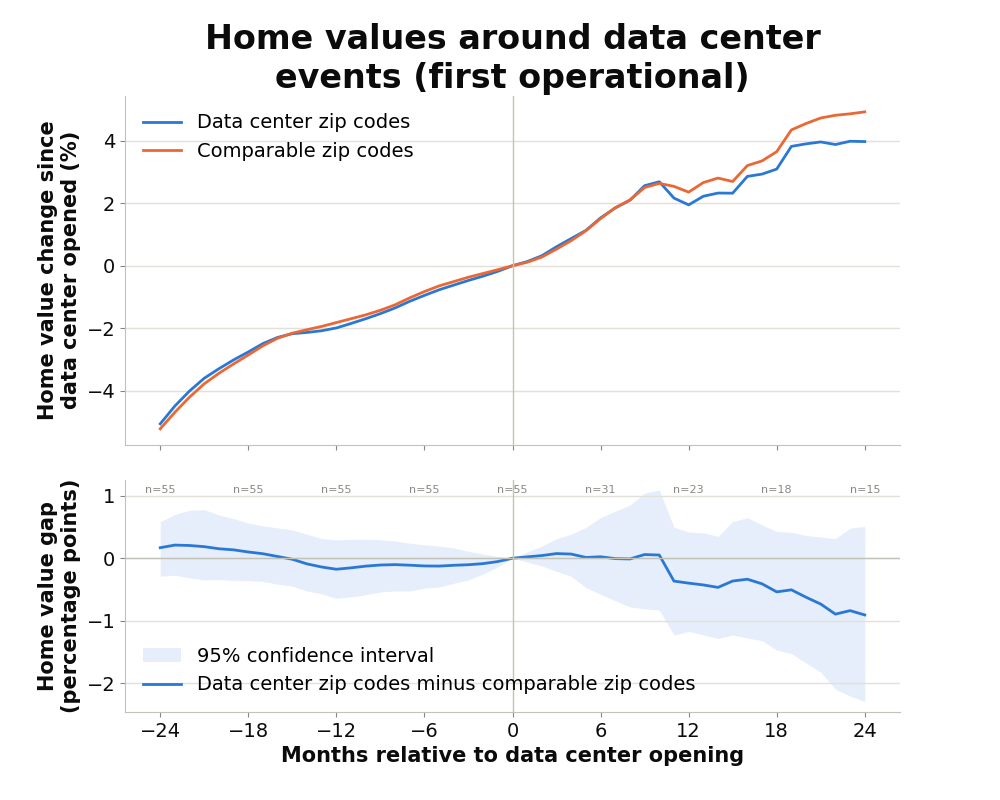

# The Impact of Data Center Construction on Nearby Home Values

**Author: Justin Winkler**

**Date: September 25, 2026**

The purpose of this project is to apply data science skills to tell a compelling, data-driven story about the effect of data centers on the estimated values of nearby homes.

<p align="center">
  
</p>

## Reproducibility

Pre-requisites: Python (v3.10 or greater)

To reproduce the analysis that generated the graph above, follow these steps:

1. Clone the repository:
    ```bash
    git clone https://github.com/jwinkle8/aipi510-proj1.git
    ```
2. Create a virtual environment and install project dependencies:
    ```bash
    python -m venv .venv
    source .venv/bin/activate
    python -m pip install -r requirements.txt
    ```
3. (Optional) If you wish run the analysis on the latest verions of these datasets, download them from the sources listed in the [citation section](#citation), otherwise use the cached datasets in the `data/raw` directory.
4. Define your desired study parameters in `study_parameters.py`:

    | Parameter | Description | Default |
    |-----------|-------------|---------|
    | `EVENT_OF_INTEREST` | Determines whether to examine the impact of the first headline about data center construction or the opening of the first data center in affected zip codes on home values. | `EventOfInterest.FIRST_HEADLINE` |
    | `EVENT_WINDOW_MONTHS` | Set the duration (in months) over which to look forward and backward at the impact of data center construction on nearby housing estimates. | `24` |
5. Open the EDA notebook `exploratory_data_analysis.ipynb` in a Jupyter Notebook editor/viewer and run all cells.
6. Generate the data visualization:
    ```bash
    python data_visualization.py
    ```
7. View the output of the analysis in the `study_visualizations` directory.

## Disclosure of the use of generative AI

Parts of this project were created with the help generative AI tools, particularly Claude Code, powered primarily by the by the Opus 5 model. My primary uses of generative AI tools involved:

- advanced manipulation of DataFrames and customization of data visualization
- consultation about an effective choice for my study's design for the data I had collected and the concerns I raised about naive approaches
- generation of a background for my infographic

All uses of AI were preceded by a best-effort attempt and were specifically prompted by asking to build off of the work I had previously completed.

## Citation

Epoch AI, ‘AI Data Centers’. Published online at epoch.ai. Retrieved from 'https://epoch.ai/data/ai-data-centers/data_centers.zip' [online resource].

Zillow Research, 'Zillow Home Value Index (ZHVI)'. Published online at zillow.com. Retrieved from 'https://files.zillowstatic.com/research/public_csvs/zhvi/Zip_zhvi_uc_sfr_tier_0.33_0.67_sm_sa_month.csv' [online resource].
